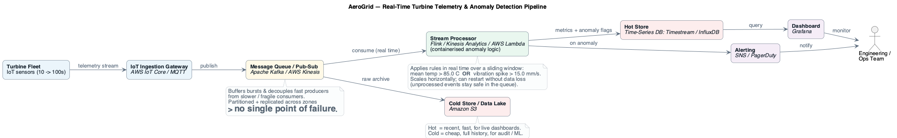
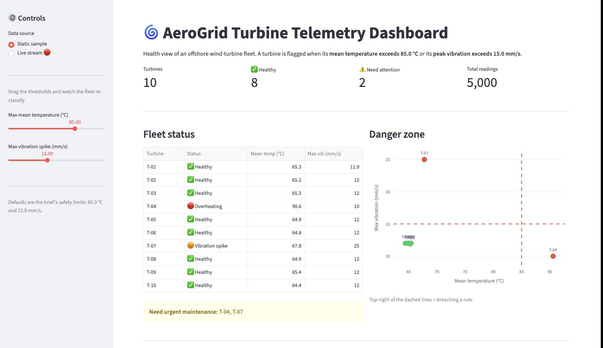
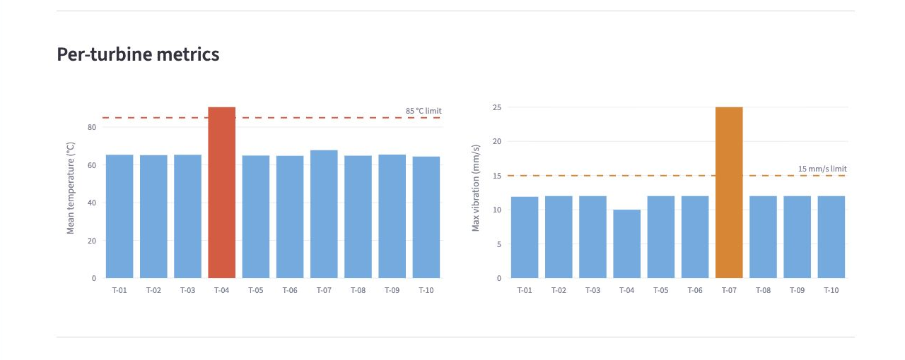
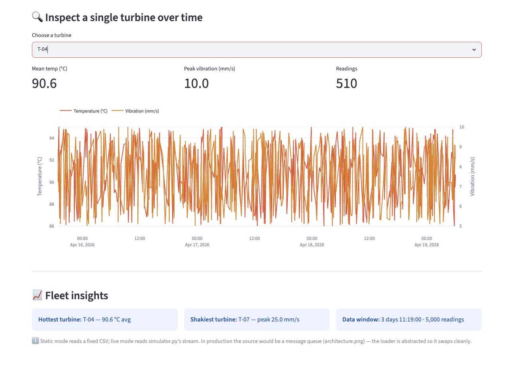
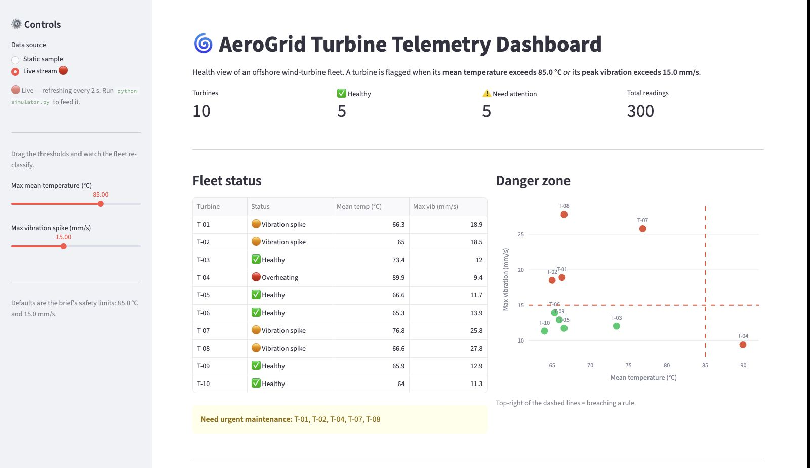

# AeroGrid Turbine Telemetry — Anomaly Detection & Streaming Architecture

> A data-processing tool that flags failing offshore wind turbines from their sensor data — packaged in Docker, with a proposed cloud architecture to run it in real time, at scale.

*Built for the Bright Network **IEUK 2026 Engineering Sector Skills Project**.*

---

## The problem

AeroGrid runs a fleet of offshore wind turbines. Each turbine carries IoT sensors streaming readings — temperature, vibration, rotation speed — around the clock. Two things were going wrong:

- **Failures slipped through.** Warning signs were buried in millions of log lines, so turbines broke down before anyone spotted them.
- **The data outgrew the system.** A single ageing server couldn't keep up with the constant flood of sensor data.

The brief: **analyse a sample of the telemetry to find the failing turbines now**, and **design a modern, scalable system** so it doesn't happen again.

## What this project does

Five parts:

1. **Data-processing script** (`main.py`) — reads the telemetry, computes each turbine's key metrics, and prints a clear list of the turbines breaching safety thresholds, with the evidence.
2. **Containerisation** (`Dockerfile`) — packages the script and its dependencies so it runs identically on any machine.
3. **Proposed cloud architecture** (`architecture.png`) — a real-time streaming pipeline that replaces the fragile single server.
4. **Interactive dashboard** (`dashboard.py`) — a Streamlit web app to explore the fleet's health visually (see the **Dashboard** section below).
5. **Live data simulator** (`simulator.py`) — streams realistic, continuously-generated readings into the dashboard's live mode, demonstrating the real-time pipeline locally (see **Live mode**).

A turbine is flagged for **urgent maintenance** if **either** rule is breached:

| Rule | Condition (per turbine) |
|------|--------------------------|
| Overheating | **mean** temperature **> 85.0 °C** |
| Vibration spike | **maximum** vibration **> 15.0 mm/s** |

## Results

Run against the provided sample (5,000 readings across 10 turbines), the script flags **two** turbines:

```
T-04: Mean temperature (90.58°C) exceeds 85.0°C
T-07: Maximum vibration (25.00 mm/s) exceeds 15.0 mm/s
```

- **T-04** — sustained overheating (mean 90.6 °C).
- **T-07** — a dangerous vibration spike (peak 25.0 mm/s).

The other eight turbines are within safe limits. Results were verified by hand against the raw data and tested against edge cases (empty input, single-reading turbines).

## Proposed architecture

The script answers *"which turbines are failing right now?"* The architecture answers *"how do we watch **every** turbine **continuously**, without losing data or depending on one server?"*



- **Message queue** (Kafka / Kinesis) buffers the firehose of readings and decouples ingestion from processing — replicated across zones, so there is **no single point of failure**.
- **Stream processor** (Flink / AWS Lambda) runs the anomaly rules in real time as each reading arrives.
- **Hot storage** (time-series DB) powers live dashboards; **cold storage** (data lake) archives everything cheaply for the long term.
- **Alerting** notifies engineers the instant a turbine crosses a threshold.

## Tech stack

| Tool | Used for | Why |
|------|----------|-----|
| **Python + pandas** | data processing | pandas is the industry standard for fast, expressive work on tabular / CSV data |
| **Docker** | packaging | guarantees the script runs the same anywhere — *"works on my machine"* → works everywhere |
| **PlantUML** | architecture diagram | diagrams kept as version-controlled text |
| **Streamlit + Plotly** | interactive dashboard | turns the analysis into a UI anyone can explore — pure Python, no front-end code |

## Project structure

```
.
├── main.py              # the anomaly-detection script
├── dashboard.py         # interactive Streamlit dashboard
├── simulator.py         # live data generator (feeds the dashboard's live mode)
├── requirements.txt     # Python dependencies (pinned)
├── requirements-dashboard.txt   # dashboard deps (streamlit + plotly)
├── Dockerfile           # container definition
├── .dockerignore
├── telemetry_data.csv   # sample sensor data (5,000 readings, 10 turbines)
├── architecture.puml    # architecture diagram (source)
├── architecture.png     # architecture diagram (rendered)
└── report.md            # one-page engineering report to the CTO
```

## Setup & run

From a clean clone:

```bash
git clone https://github.com/georgijv-sys/turbine-telemetry-anomaly-detection.git
cd turbine-telemetry-anomaly-detection

python3 -m venv .venv
source .venv/bin/activate          # Windows: .venv\Scripts\activate
pip install -r requirements.txt

python main.py
```

You should see the two flagged turbines (T-04, T-07) printed with their readings.

### Run with Docker (no Python setup needed)

```bash
docker build -t aerogrid .
docker run --rm aerogrid
```

## Dashboard

Prefer to *see* the fleet rather than read terminal output? `dashboard.py` is an interactive [Streamlit](https://streamlit.io) web app built on the **same** `compute_metrics` logic — no detection code is duplicated.

```bash
pip install -r requirements-dashboard.txt   # streamlit + plotly
streamlit run dashboard.py
```

It starts a local web server and opens in your browser at **http://localhost:8501**. Streamlit keeps running until you stop it with **Ctrl + C** — launch it once and leave it running. (Re-running the command in the same terminal does nothing; that terminal is now hosting the server. To see code changes, just save the file and click **Rerun** in the browser.)

### Dashboard walkthrough


The opening view combines the threshold controls, KPIs, fleet table, and danger-zone scatter. On the static sample it immediately identifies **T-04** as overheating and **T-07** as the vibration-spike case.



The next section breaks the two rules into separate per-turbine charts. The red bar shows the mean-temperature breach; the orange bar shows the maximum-vibration breach.



The drill-down lets you inspect one turbine's raw readings across the sample window. Here **T-04** is selected, matching the hottest-turbine insight at the bottom of the dashboard.



Live mode uses `simulator.py` to feed a rolling window of generated readings into the same dashboard. The KPIs, fleet table, and danger-zone scatter update together as injected faults develop.



What you can explore:

- **Fleet status** — every turbine colour-tagged Healthy / Overheating / Vibration spike, with its metrics.
- **Adjustable thresholds** — sliders to change the 85 °C / 15 mm/s limits and watch the fleet re-classify live.
- **"Danger zone" chart** — temperature vs vibration with the limits drawn in; anything top-right is breaching a rule.
- **Per-turbine bars** and a **single-turbine time-series** drill-down.
- **Fleet insights** — hottest turbine, shakiest turbine, the data's time window.

### Live mode — real-time simulation

The dashboard isn't limited to the static sample. **`simulator.py`** mimics the live sensor feed: it generates fresh readings every second — **automatically injecting faults that worsen over time** — and writes a rolling window to `live_telemetry.csv`. Switch the sidebar to **"Live stream 🔴"** and watch the fleet evolve in real time, turbines climbing and flipping red as faults emerge.

Run the simulator and dashboard in two terminals:

```bash
python simulator.py            # terminal 1 — the producer (Ctrl+C to stop)
streamlit run dashboard.py     # terminal 2 — the dashboard (sidebar → Live stream 🔴)
```

> **Note:** `live_telemetry.csv` is **not** in the repo — it's *generated* by the simulator at runtime (gitignored, like `.venv`). A fresh clone won't have it until you run `python simulator.py`; open Live mode before then and the dashboard just prompts you to start the simulator.

**How it mirrors the architecture:** `simulator.py` (the producer) and `live_telemetry.csv` (the channel) are a local stand-in for the streaming pipeline — in production the sensors would publish to a message queue (Kafka / Kinesis) and the dashboard would subscribe. The data loader is abstracted, so the source swaps without touching the UI, and the bounded rolling window mirrors the **hot-storage** idea: only recent data is kept fast and small.

## How the detection works

1. **Load** the CSV into a pandas DataFrame.
2. **Group by turbine** and compute two metrics per turbine: mean temperature and maximum vibration.
3. **Flag** any turbine whose mean temperature exceeds 85.0 °C **or** whose peak vibration exceeds 15.0 mm/s.
4. **Report** each failing turbine, the rule it broke, and the offending value.

The thresholds live in named constants at the top of `main.py`, so they are trivial to adjust.

---

*A sector-skills learning project. The script and container are fully working; the cloud architecture is a proposed design.*
